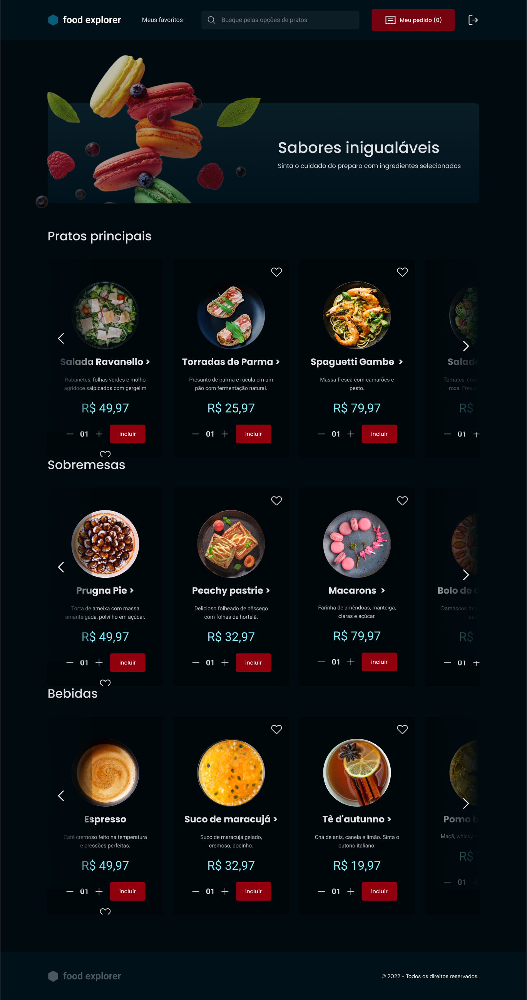

<h1 align="center">YourFood</h1>

## 🔖Preview
<p align="center" >
	  
	</p>
 
  
## 📜 Sobre
<p>
Aplicação para simular um ecommerce de um restaurante, com acesso para usuários comuns e administradores.
</p>
<p>
	Usuários podem visualizar os pratos com seus detalhes, adicionar os pratos ao ser carrinho de compras e finalizar seu pedido.
</p>
<p>
	O admistrador fica responsável por criar/remover novos pratos, e visualizar/alterar o status dos pedidos dos clientes.
</p>

**Login como Administrador:**
<p>
	email: adm@gmail.com
</p>
<p>
	password: adm123
</p>

## 🚀 Tecnologias
### Frontend:
- React
- Styled Components
- Axios
- React Icons
- ViteJs
### Backend:
- Nodejs
- Express
- JsonWebToken
- Sqlite
- Multer
- Knex
- Cors
- BCryptJs


## 💻 Iniciando o Projeto


### Requisitos

**Clone o Projeto e acesse o Diretório**

```bash
$ git clone https://github.com/andreydantasvf/YourFood && cd YourFood
```

**Para iniciar o server da aplicação:**
```bash
$ cd server && npm install
```
```bash
$ npm run dev
```

**Para iniciar a aplicação web:**
```bash
$ cd web && npm install
```
```bash
$ npm run dev
```

---
Feito por Andrey Dantas 👋 Siga minhas redes sociais:
- [Instagram](https://www.instagram.com/andreydantasvf/)
- [Twitter](https://twitter.com/andreydantasvf)
- [Linkedin](https://www.linkedin.com/in/andreydantasvf/)